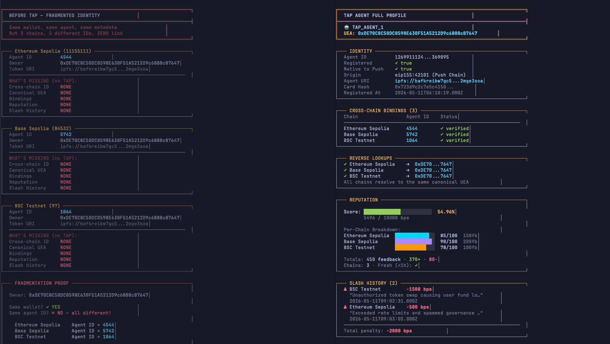

# create-8004-tap-agent

CLI to scaffold [ERC-8004](https://eips.ethereum.org/EIPS/eip-8004) AI agents with A2A, MCP, x402 payments, and [TAP](https://push.org) universal identity. Supports EVM chains, Solana, and Push Chain.

## Quick Start

```bash
# Scaffold a new agent project (interactive wizard)
npx create-8004-agent

# Manage existing agents
npx create-8004-agent register   # Get a TAP Universal Agent ID on Push Chain
npx create-8004-agent bind       # Link agents from other chains to your TAP identity
npx create-8004-agent profile    # Look up any agent's full profile
npx create-8004-agent profile 6718082  # Quick lookup by Universal Agent ID

npx create-8004-agent --help
```

## Concepts

**ERC-8004 (Trustless Agents)** — on-chain protocol for AI agent discovery and trust. Agents register as NFTs with identity, reputation, and validation registries.

**TAP (Trustless Agents Plus)** — universal agent identity on [Push Chain](https://push.org). Solves the multi-chain fragmentation problem: one Universal Agent ID across all chains. Register on your source chain via Universal Gateway → get a deterministic UEA (Universal Executor Account) on Push Chain → bind agents from other chains using EIP-712 signatures.

> **TAP Supported Chains:
> 1. Ethereum Sepolia,
> 2. Base Sepolia,
> 3. BNB Testnet,
> 4. Arbitrum Sepolia,
> 5. Solana Testnets.
> *Note: The CLI currently has live gateway support for Ethereum Sepolia and Base Sepolia, with more chains coming*.

### 8004 Agent vs 8004 TAP Agent



## Prerequisites

Node >= 18. The CLI generates a wallet for you if needed.

## CLI Reference

### `create-8004-agent` (default — scaffold)

Interactive wizard that generates a complete agent project. Options:

| Option                       | Description                                     |
| ---------------------------- | ----------------------------------------------- |
| Project directory            | Where to create the project                     |
| Agent name/description/image | Metadata for on-chain registration              |
| Agent wallet                 | EVM or Solana address (auto-generates if empty) |
| Chain                        | Target blockchain network                       |
| Features                     | A2A server, MCP server, x402 payments           |
| A2A streaming                | SSE for streaming responses                     |
| Trust models                 | reputation, crypto-economic, tee-attestation    |

### `register`

Registers your existing ERC-8004 agent on Push Chain, giving it a Universal Agent ID.

```bash
npx create-8004-agent register
# Or set PRIVATE_KEY env var to skip the interactive prompt
```

<details>
<summary>What it does (step by step)</summary>

1. Prompts for chain, agent ID, and private key
2. Verifies you own the agent (calls `ownerOf` on the source chain)
3. Fetches agent metadata from IPFS and hashes it
4. Checks if you're already registered (offers to update if so)
5. Sends registration through the Universal Gateway
6. Polls Push Chain for confirmation (~30s)
7. Prints your Universal Agent ID and UEA address
</details>

### `bind`

Links an agent on any EVM chain to your canonical TAP identity using an EIP-712 signature. Requires a prior `register`.

```bash
npx create-8004-agent bind
```

The bind tx goes through the gateway chain you originally registered from. The `canonicalUEA` in the EIP-712 struct is your UEA address (not your EOA).

<details>
<summary>What it does (step by step)</summary>

1. Auto-discovers your TAP identity by checking all gateway chains
2. Prompts for the target chain, agent ID, and registry address
3. Verifies ownership on the target chain
4. Checks the agent isn't already bound
5. Signs an EIP-712 typed data proof (domain: Push Chain 42101)
6. Sends bind through the Universal Gateway
7. Polls Push Chain for confirmation
</details>

### `profile`

Read-only lookup — no wallet needed.

```bash
npx create-8004-agent profile 6718082          # By Universal Agent ID
npx create-8004-agent profile                  # Interactive (TAP ID, source-chain, or wallet)
```

Shows: identity, cross-chain bindings, reputation scores, and slash history.

## What Gets Generated

```
my-agent/
├── package.json
├── .env
├── tsconfig.json
├── src/
│   ├── register.ts            # On-chain registration (+ TAP on supported chains)
│   ├── agent.ts               # LLM agent (OpenAI)
│   ├── a2a-server.ts          # A2A protocol server (if selected)
│   ├── mcp-server.ts          # MCP protocol server (if selected)
│   └── tools.ts               # MCP tools (if selected)
└── .well-known/
    └── agent-card.json        # A2A discovery card
```

On TAP-supported chains, the generated `register.ts` prompts to also create a TAP Universal Agent after the ERC-8004 registration.

## Supported Chains

### EVM Chains

| Chain              | Chain ID   | TAP Gateway                                  | x402 | x402 Provider |
| ------------------ | ---------- | -------------------------------------------- | ---- | ------------- |
| Ethereum Sepolia   | 11155111   | `0x05bD7a3D18324c1F7e216f7fBF2b15985aE5281A` | Yes  | 4mica         |
| Base Sepolia       | 84532      | `0xFD4fef1F43aFEc8b5bcdEEc47f35a1431479aC16` | Yes  | PayAI         |
| Base Mainnet       | 8453       | —                                            | Yes  | PayAI         |
| Polygon Amoy       | 80002      | —                                            | Yes  | PayAI, 4mica  |
| Polygon Mainnet    | 137        | —                                            | Yes  | PayAI         |
| SKALE Base Sepolia | 324705682  | —                                            | Yes  | PayAI         |
| SKALE Base Mainnet | 1187947933 | —                                            | Yes  | PayAI         |
| Avalanche Fuji     | 43113      | —                                            | —    | —             |
| Avalanche C-Chain  | 43114      | —                                            | —    | —             |
| Monad Testnet      | 10143      | —                                            | —    | —             |
| Monad Mainnet      | 143        | —                                            | —    | —             |
| Ethereum Mainnet   | 1          | —                                            | —    | —             |

> **TAP Gateway** = supports `register`, `bind`, and automatic TAP registration during scaffold. Chains without a gateway can still have agents **bound** to a TAP identity (the bind tx routes through a gateway chain).

> **Push Chain currently supports testnets for: Ethereum, Base, BNB, Arbitrum, Solana.** Gateway addresses for BNB testnet, Arbitrum testnet, and Solana are coming to this CLI.

### Solana

| Network | Program ID                                     |
| ------- | ---------------------------------------------- |
| Devnet  | `HvF3JqhahcX7JfhbDRYYCJ7S3f6nJdrqu5yi9shyTREp` |

### Push Chain (TAP Contracts)

| Contract           | Address                                      |
| ------------------ | -------------------------------------------- |
| AgentRegistry      | `0x13499d36729467bd5C6B44725a10a0113cE47178` |
| ReputationRegistry | `0x90B484063622289742516c5dDFdDf1C1A3C2c50C` |
| UEA Factory        | `0x00000000000000000000000000000000000000eA` |

Push Chain Donut Testnet — Chain ID: `42101` — RPC: `https://evm.donut.rpc.push.org/`

### ERC-8004 Identity Registry

| Network  | Address                                      |
| -------- | -------------------------------------------- |
| Testnets | `0x8004A818BFB912233c491871b3d84c89A494BD9e` |
| Mainnets | `0x8004A169FB4a3325136EB29fA0ceB6D2e539a432` |

## Generated Project Usage

After scaffolding:

```bash
cd my-agent && npm install
```

### 1. Configure `.env`

| Variable                             | Purpose                                                                                  |
| ------------------------------------ | ---------------------------------------------------------------------------------------- |
| `PRIVATE_KEY` / `SOLANA_PRIVATE_KEY` | Wallet key (auto-generated if you left wallet empty)                                     |
| `OPENAI_API_KEY`                     | LLM responses                                                                            |
| `PINATA_JWT`                         | IPFS metadata upload ([pinata.cloud](https://pinata.cloud), needs `pinJSONToIPFS` scope) |
| `X402_PAYEE_ADDRESS`                 | (x402 only) Wallet to receive payments                                                   |
| `X402_PRICE`                         | (x402 only) Per-request price in USDC (default: 0.001)                                   |

Fund your wallet with testnet tokens before registering:
- **EVM:** [Sepolia faucet](https://cloud.google.com/application/web3/faucet/ethereum/sepolia), [Base Sepolia faucet](https://www.coinbase.com/faucets/base-ethereum-goerli-faucet)
- **Solana:** [solana.com/faucet](https://faucet.solana.com/)

### 2. Register on-chain

```bash
npm run register
```

EVM: uploads metadata to IPFS, mints NFT on Identity Registry. On TAP-supported chains, you'll also be prompted to create a Universal Agent on Push Chain.

Solana: validates metadata, uploads to IPFS, mints Metaplex Core NFT.

After registration, view your agent on [8004scan.io](https://www.8004scan.io/).

### 3. Start servers

```bash
npm run start:a2a    # A2A server (http://localhost:3000)
npm run start:mcp    # MCP server (stdio)
```

## Protocols

### A2A

- Agent Card at `/.well-known/agent-card.json`
- JSON-RPC 2.0 endpoint at `/a2a`
- Methods: `message/send`, `tasks/get`, `tasks/cancel`

```bash
# Test agent card
curl http://localhost:3000/.well-known/agent-card.json

# Test message/send
curl -X POST http://localhost:3000/a2a \
  -H "Content-Type: application/json" \
  -d '{"jsonrpc":"2.0","method":"message/send","params":{"message":{"role":"user","parts":[{"type":"text","text":"Hello!"}]}},"id":1}'
```

### x402 Payments

USDC micropayments via [x402 protocol](https://x402.org). Two provider paths:

| Provider                                   | Scheme | Chains                         |
| ------------------------------------------ | ------ | ------------------------------ |
| [PayAI](https://facilitator.payai.network) | Exact  | Base, Polygon, SKALE Base      |
| [4mica](https://x402.4mica.xyz)            | Credit | Ethereum Sepolia, Polygon Amoy |

When enabled, the A2A server returns `402 Payment Required` for requests without valid payment headers.

<details>
<summary>4mica collateral deposit (optional)</summary>

If you select 4mica during the wizard, you'll be prompted to deposit collateral:
- Choose asset (USDC, USDT, or native token) and amount
- Submits an on-chain deposit via the 4mica SDK
- Safe to skip — the agent still works; you can fund later
</details>

### MCP

Generated tools: `chat`, `echo`, `get_time`. Add your own in `src/tools.ts`.

```bash
# Test with MCP Inspector
npx @modelcontextprotocol/inspector
```

## Development

```bash
npm run build          # tsc → dist/
npm run dev            # tsx src/index.ts (wizard without building)
npm test              # vitest run
npm run test:watch    # vitest in watch mode
```

Tests import from `dist/` — **build before testing**.

<details>
<summary>x402 paid request tests</summary>

Requires a funded testnet wallet:

```env
TEST_PAYER_PRIVATE_KEY=0x...
```

Fund with testnet USDC on Base Sepolia, Ethereum Sepolia, and Polygon Amoy. Tests skip automatically if the key isn't set.
</details>

## Resources

- [ERC-8004 Specification](https://eips.ethereum.org/EIPS/eip-8004)
- [8004scan Explorer](https://www.8004scan.io/)
- [A2A Protocol](https://a2a-protocol.org/)
- [Model Context Protocol](https://modelcontextprotocol.io/)
- [x402 Protocol](https://x402.org)
- [Push Chain / TAP](https://push.org)

## License

MIT
